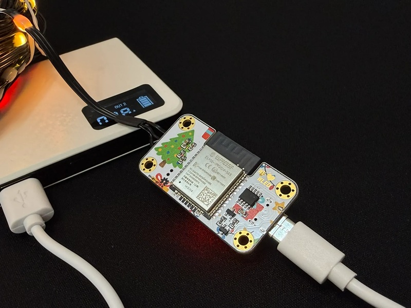
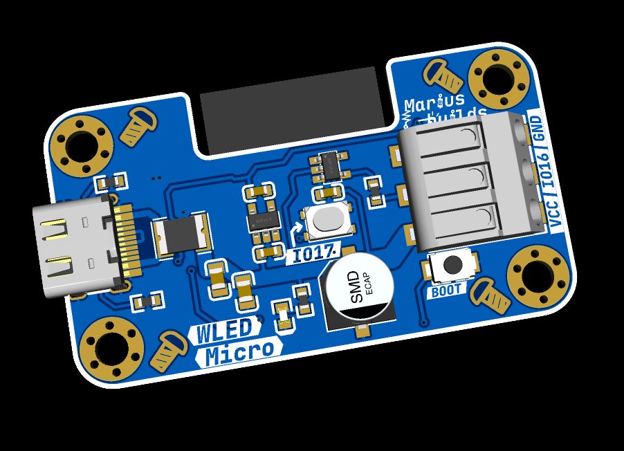
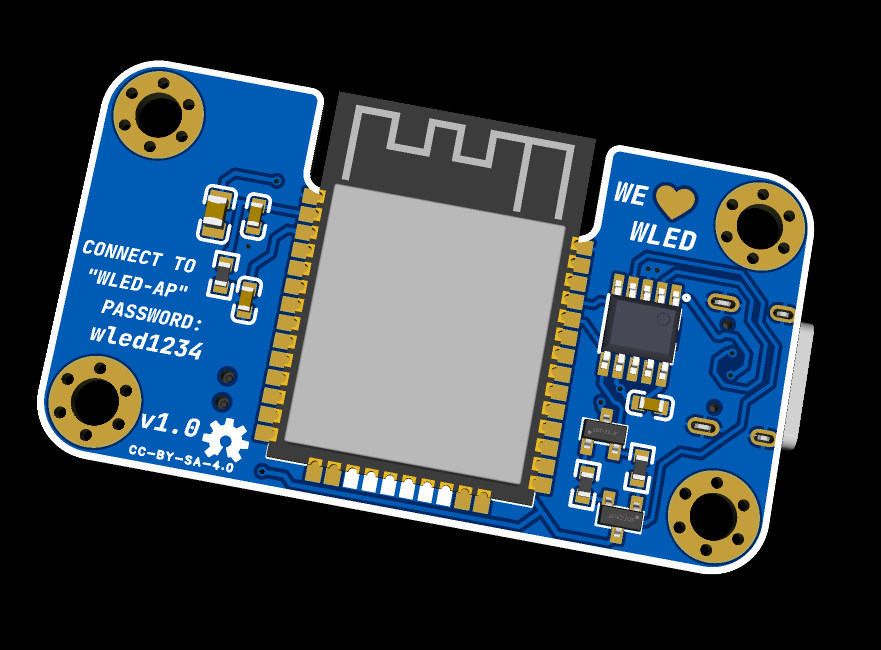
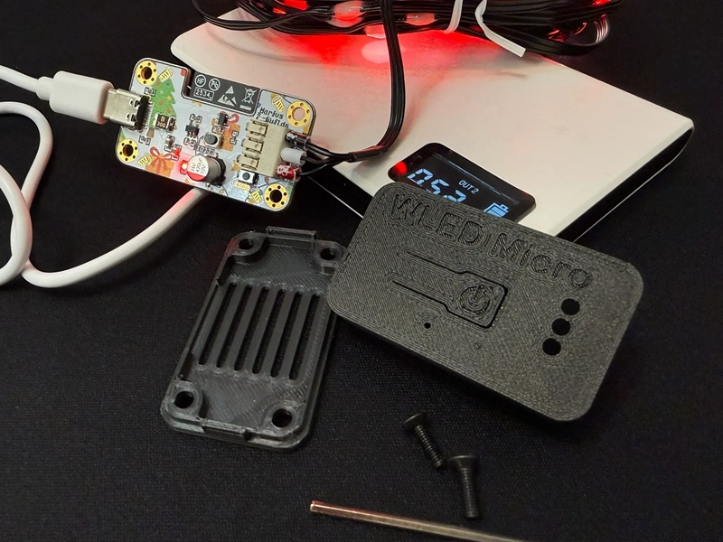

# WLED Micro: Portable Christmas Lights Controller 🎄

The smallest and most portable ESP32-powered WLED controller I've built so far. Plug it into a power bank (at 5V), connect your LED strip, and suddenly *you* are the Christmas decoration.

Built for the **OSHWLab Christmas Hackathon 2025**, which is why the color PCB version looks like it was wrapped by Santa's elves.

## MAIN FEATURES :

- **ESP32-WROOM-32E (4MB)** - full WLED power in a tiny footprint. All the effects, none of the bulk.
- **USB-C power input** - works with any USB-C power bank, wall adapter or portable battery. Proper 5.1kΩ CC resistors included, so even C-to-C cables play along.
- **Onboard CH340K USB-to-serial** - flash WLED straight from your browser, no external programmer needed.
- **SN74LVC1G17 level shifter** - turns the ESP32's shy 3.3V data signal into a confident 5V one, so your LEDs actually listen.
- **Resettable fuse + 470µF capacitor** - protection against shorts, and a smooth power supply for the LEDs when they all decide to go full white at once.
- **Push-in terminal (VCC / IO16 / GND)** - connect the LED strip without a screwdriver.
- **Two buttons** - BOOT for flashing, plus a **user button on IO17** for changing effects, toggling the lights, or impressing people at parties.
- **Mounting holes and a 3D-printable case** - so it survives being thrown in a backpack.
- **AP password printed on the board** - because nobody remembers `wled1234` at 11 PM on Christmas Eve.

 

## Built for portability

Whether it's powered from a power bank, a USB-C battery pack or a compact charger, WLED Micro lets you create light wherever you go. Perfect for:

- Cosplay props
- LED poi / staff setups
- Holiday decorations
- Backpack and room accents
- Quick demos and prototyping

## IMPORTANT INFORMATIONS ! 

1. **5V LEDs only, MAXIMUM 2A.** In the WLED app, go to **LED Preferences** and set the maximum current to **2000 mA**.

2. **There is no step-up or step-down converter for the LEDs.** USB-C powers both the ESP32 and the LEDs directly; only a small LDO makes the 3.3V for the ESP32. Whatever your power source gives, the LEDs get.

3. **Check that your power bank or adapter can supply enough current.** A WS2812B LED can draw up to ~60mA at full white, so 100 LEDs at full brightness = 6A = a sad, shut-down power bank. Let WLED's current limiter do its job.

4. **Avoid exceeding your power bank's current limit.** Most power banks don't negotiate, they just turn off.

## Installing WLED 

1. Open the official web installer: https://install.wled.me/
2. **Hold down the BOOT button while plugging the USB-C cable into your PC**, then release it.
3. Click install and select the correct COM port. (If no port shows up, install the CH340 driver first: https://www.wch-ic.com/downloads/CH341SER_EXE.html)
4. Connect to the **WLED-AP** Wi-Fi network (password: **wled1234**, as conveniently printed on the board) and set up your home Wi-Fi.
5. In **Config → LED Preferences**, set the LED data pin to **GPIO16**, the button to **GPIO17**, and the max current to **2000 mA**.

For more info about WLED, check the official docs: https://kno.wled.ge/. And don't forget to show some appreciation to Aircoookie and the whole WLED team for their awesome work!

##  WLED Mobile App

- Google Play: https://play.google.com/store/apps/details?id=ca.cgagnier.wlednativeandroid
- Apple App Store: https://apps.apple.com/us/app/wled-native/id6446207239

## Main components 

| Part | Component | LCSC |
|---|---|---|
| MCU | ESP32-WROOM-32E (4MB) | C701341 |
| USB-to-serial | CH340K | C968586 |
| LDO 3.3V | AP2112K-3.3TRG1 | C51118 |
| Level shifter | SN74LVC1G17DBVR | C7836 |
| Resettable fuse | 1812L300/24GR | C20627123 |
| LED capacitor | 470µF 10V | C5373410 |
| USB-C connector | GT-USB-7010ASV | C2988369 |
| LED terminal | HDGC4001SMD-S-3P | C5197185 |

Full BOM in the **GERBER, BOM, PNP** folder.

## 3D-printable case 

The case files are in the **STL FILES and F3Z** folder, and also on Printables: https://www.printables.com/model/1546668-wled-micro-controller-case

 The WS2812B LED strip in the photos (black wire, 20m) can be found here: https://www.aliexpress.com/item/1005005598428130.html

## If you want to edit the PCB

**Project can also be found here:** https://oshwlab.com/mariusmym/wled-micro

## License 

This project is licensed under [Creative Commons Attribution-ShareAlike 4.0 International](https://creativecommons.org/licenses/by-sa/4.0/).

- ✅ **Share** – copy and redistribute it in any medium or format
- ✅ **Adapt** – remix, transform, and build upon it, even commercially
- 🏷️ **Attribution** – give credit and link back here
- 🔁 **ShareAlike** – if you remix it, share your version under the same license

## Donate ☕

If you'd like to say thanks or buy me a coffee, a **[PayPal donation](https://www.paypal.com/donate/?hosted_button_id=KHR7DYJP2Z8QJ)** is always appreciated!

Have fun with it ! 😊
